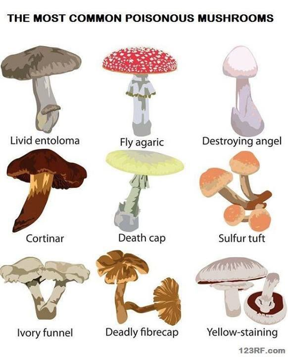
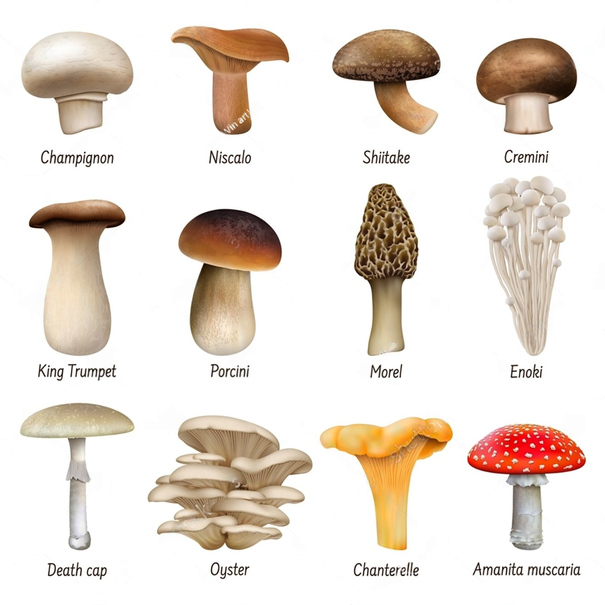

 - Mushroom Class is a categorical column with values 0 and 1, where 0 represents edible mushrooms and 1 represents poisonous mushrooms. The classification of mushrooms into edible and poisonous is critical for foraging and consumption, as some poisonous mushrooms can cause severe health issues or even be fatal.

- Fitting of all common categorical distribution tests has been carried out for this column. Among the distributions tested, Class did not conform to any distributions. Consequently, we reject all the null hypotheses that a distribution for class exists at all significance levels α: 0.1, 0.05, 0.001.

#### Some Common poisonuou mushrooms include:

#### Some Common edible mushrooms include:

##### *click on the distribution to see the result fitted line